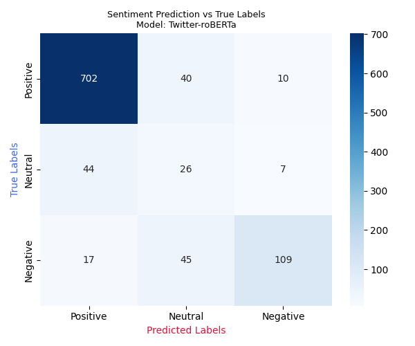
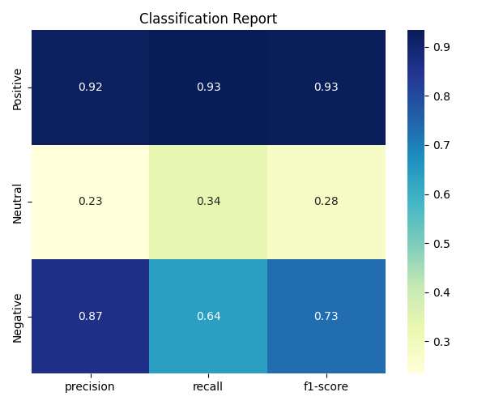
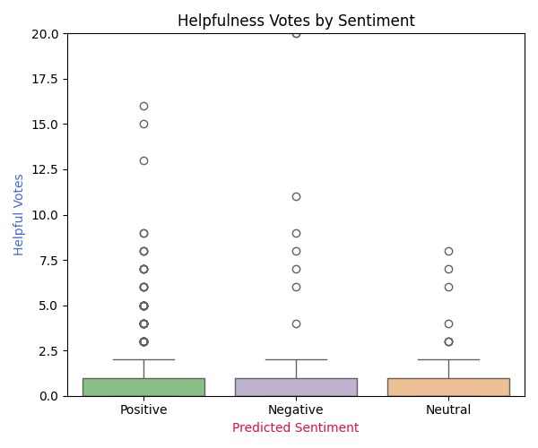

# Amazon Reviews Sentiment Analyzer 
        

#### A Python-based CLI tool for sentiment analysis on Amazon product reviews using state-of-the-art transformer models. It compares predicted sentiment with star ratings to assess correlation, fetching real reviews, processing them, and visualizing results with helpfulness insights.
---

## 🎯 The Problem
This project refers to the challenges discussed in the paper [`Challenges in Sentiment Analysis by Saif M. Mohammad, 2017`](https://ufal.mff.cuni.cz/~hana/teaching/Mohammad2017_Chapter_ChallengesInSentimentAnalysis.pdf).
Specifically, it focuses on exploring the correlation between sentiment analysis to star ratings, as well as the impact of sentiment on *helpful vote* votes.

🔍 Scope
Implemented:
- CLI tool for analyzing Amazon product reviews
- Integration with 5 transformer models via Hugging Face to choose from
- Mapping of ratings to sentiments and evaluate the correlation to the sentiment prediction
- Helpfulness-based visual insights
- Confusion matrix and classification report generation and visualization

Future Work:
- Aspect-based sentiment detection (e.g., food vs. service)
- Incorporating helpfulness scores as weights in evaluation or model fine-tuning to emphasize more impactful reviews
- Sarcasm/irony detection


## 🏃 How to Run
#### 1. Install dependencies:
```
pip install -r requirements.txt
```
#### 2. Run sentiment analysis:
```
python main.py --num_reviews 500 --model_id 1 --verbose 2
```

### Arguments

| Argument      | Type | Default Value | Description                            |
|---------------|------|----------|---------------------------------------------|
| `--num_reviews` | *int*  | 1000 | Number of reviews to process (default: 100) |
| `--model_id`    | *int*  | 0 | Model to use (0–4, see below)                  |
| `--verbose`     | *int*  | 1 | Verbosity: 0=silent, 1=summary, 2=debug        |


## 🤖 Supported Models

| ID | Model Name |
|----|------------|
| 0 | [cardiffnlp/twitter-roberta-base-sentiment-latest (Twitter-roBERTa)](https://huggingface.co/cardiffnlp/twitter-roberta-base-sentiment-latest) |
| 1 | [distilbert-base-uncased-finetuned-sst-2-english (DistilBERT)](https://huggingface.co/distilbert-base-uncased-finetuned-sst-2-english) |
| 2 | [finiteautomata/bertweet-base-sentiment-analysis (BERTweet)](https://huggingface.co/finiteautomata/bertweet-base-sentiment-analysis) |
| 3 | [nlptown/bert-base-multilingual-uncased-sentiment (Multilingual BERT)](https://huggingface.co/nlptown/bert-base-multilingual-uncased-sentiment) |
| 4 | [siebert/sentiment-roberta-large-english (SiEBERT)](https://huggingface.co/siebert/sentiment-roberta-large-english) |

## 📊 Outputs
Check the `visualizations/` folder after execution for:
### `Confusion_Matrix.png`

### `Classification_Report.png`

### `Help_Distribution.png`


For raw printed outputs, consider redirecting stdout to a file:
```
python main.py --num_reviews 100 --model_id 2 --verbose 2 > sample_output.txt
```

## 📁 Project Structure
```
.
├── main.py
├── amazon_reviews_sentiment_analyzer.py
├── utils.py
├── requirements.txt
├── data/
│   └── raw_review_All_Beauty/... (Arrow dataset file)
└── visualizations/
    ├── Confusion_Matrix.png
    ├── Classification_Report.png
    └── Help_Distribution.png
```
---
## 📌 Notes
- The dataset file should be present under data/raw_review_All_Beauty/ as .arrow file format.
- Ensure model directories (if local) are correctly set for bertweet (model_id = 2).

## 🙌 Acknowledgments
- HuggingFace Transformers
- HuggingFace Datasets
- Scikit-learn
- Amazon Reviews Dataset
